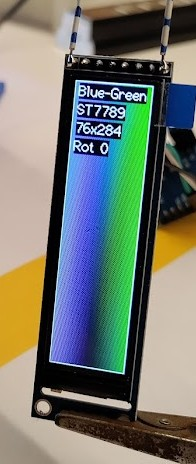

A platformio example project running on a ESP8266 demonstrating the TFT_eSPI library working with an ST7789 76x284 TFT display module.

It serves as a starting point for using this display in other projects.

